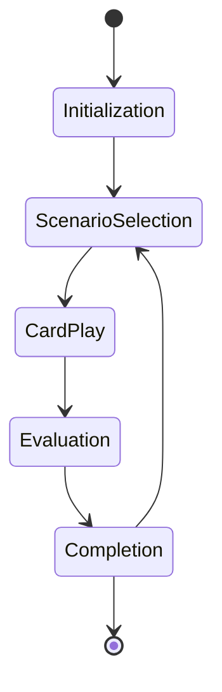

# Gameplay State Machine

## States
1. **Initialization**
   - Load player profile
   - Load scenario deck
   - Initialize game board

2. **Scenario Selection**
   - Player selects scenario
   - Load scenario details
   - Initialize scenario state

3. **Card Play**
   - Player selects card
   - System validates selection
   - Apply card effect

4. **Evaluation**
   - Check solution steps
   - Calculate score
   - Update player progress

5. **Completion**
   - Display results
   - Save progress
   - Unlock new scenario

## Transitions
- `Initialization -> Scenario Selection` (auto)
- `Scenario Selection -> Card Play` (player action)
- `Card Play -> Evaluation` (auto)
- `Evaluation -> Completion` (auto)
- `Completion -> Scenario Selection` (player action)

## State Diagram


## Implementation
```python
class GameStateMachine:
    def __init__(self):
        self.current_state = 'initialization'
        
    def transition(self, action):
        if self.current_state == 'initialization':
            self.current_ state = 'scenario_selection'
        elif self.current_state == 'scenario_selection' and action == 'select':
            self.current_state = 'card_play'
        # ... other transitions