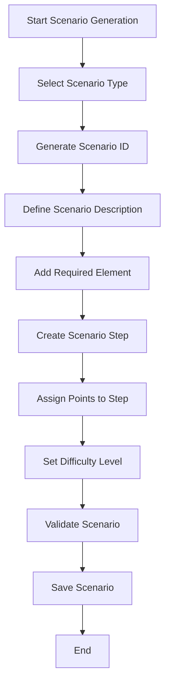

# Scenario Workflow Diagram

## Workflow Steps

1. **Select Scenario Type**
   - Choose from diagnostic, repair, maintenance, emergency

2. **Generate Scenario ID**
   - Auto-generate unique identifier

3. **Define Scenario Description**
   - Write clear scenario description

4. **Add Required Element**
   - Select 2-5 knowledge areas

5. **Create Scenario Step**
   - Define 3-5 logical steps

6. **Assign Points to Step**
   - Distribute 100 points across steps

7. **Set Difficulty Level**
   - Assign difficulty level

8. **Validate Scenario**
   - Check all rules are met

9. **Save Scenario**
   - Store in database